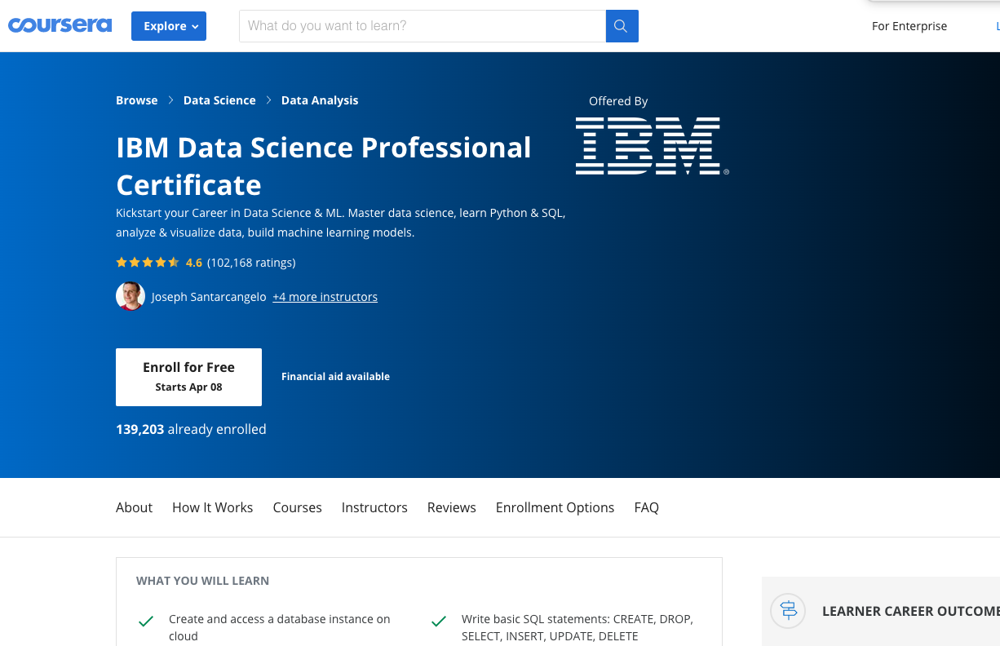
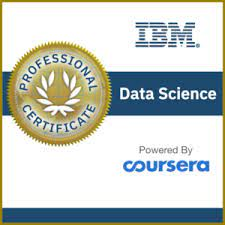
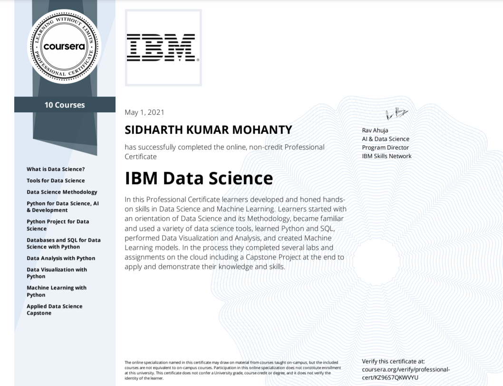

# IBM-Data-Science-Professional-Certificate
## Finally!!! Completed my favorite one

## Badges:

  

## Certificate:

  

## Courses:
[IBM Data Science Professional Certificate](https://www.coursera.org/professional-certificates/ibm-data-science?utm_source=gg&utm_medium=sem&campaignid=8985360908&utm_campaign=10-IBM-Data-Science-IN&&utm_content=10-IBM-Data-Science-IN&adgroupid=86017336970&device=c&keyword=ibm%20data%20science%20course&matchtype=b&network=g&devicemodel=&adpostion=&creativeid=412873341066&hide_mobile_promo&gclid=Cj0KCQjw-LOEBhDCARIsABrC0TkDtgZvr9R4aI1GdqN8DoGPLYI3C1DkOogEsyeG8rAwhHcyw7jZwRMaApliEALw_wcB) is the one of the best data science certification i've ever did.All the quizzes and hands on labs are good.This will give you a complete skill to become a data scientist.This specilization contains 10 sub-courses.These are mentioned below.

1. [What is Data Science?](https://www.coursera.org/learn/what-is-datascience?specialization=ibm-data-science)

2. [Tools for Data Science](https://www.coursera.org/learn/open-source-tools-for-data-science?specialization=ibm-data-science)

3. [Data Science Methodology](https://www.coursera.org/learn/data-science-methodology?specialization=ibm-data-science)

4. [Python for Data Science, AI & Development](https://www.coursera.org/learn/python-for-applied-data-science-ai?specialization=ibm-data-science)

5. [Python Project for Data Science](https://www.coursera.org/learn/python-project-for-data-science?specialization=ibm-data-science)

6. [Databases and SQL for Data Science with Python](https://www.coursera.org/learn/sql-data-science?specialization=ibm-data-science)

7. [Data Analysis with Python](https://www.coursera.org/learn/data-analysis-with-python?specialization=ibm-data-science)

8. [Data Visualization with Python](https://www.coursera.org/learn/python-for-data-visualization?specialization=ibm-data-science)

9. [Machine Learning with Python](https://www.coursera.org/learn/machine-learning-with-python?specialization=ibm-data-science)

10. [Applied Data Science Capstone](https://www.coursera.org/learn/applied-data-science-capstone?specialization=ibm-data-science)

